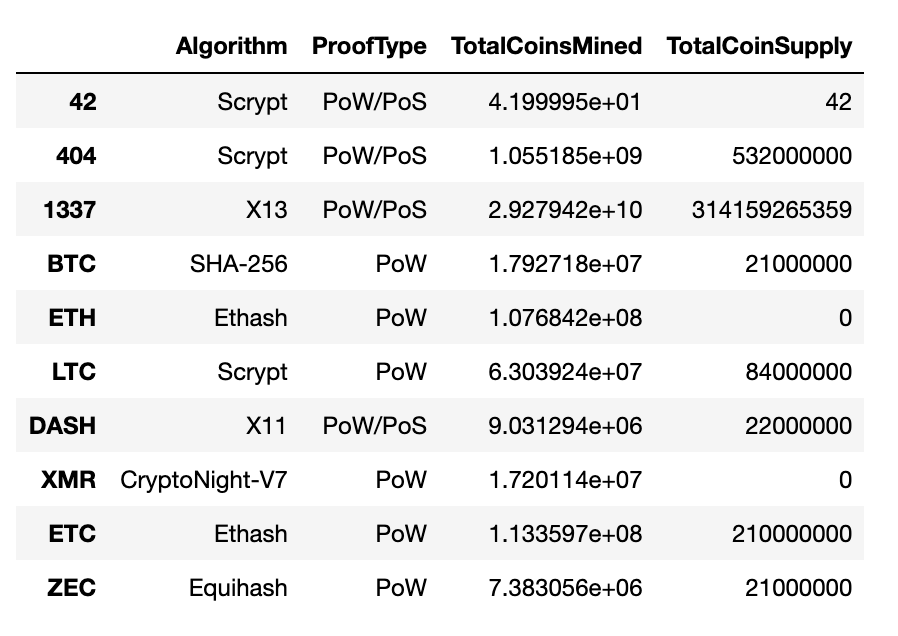
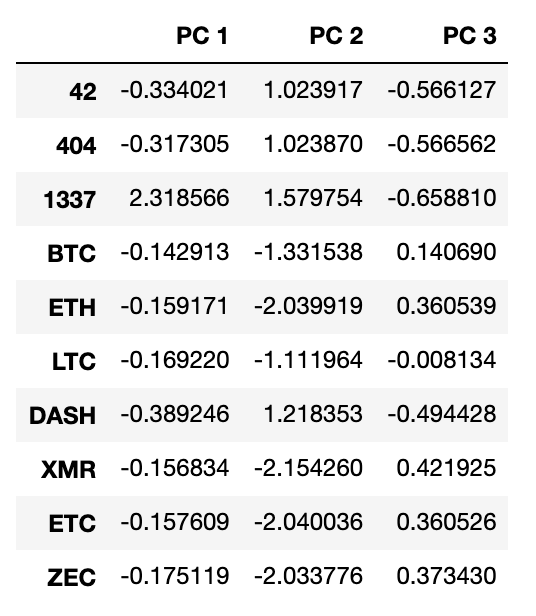
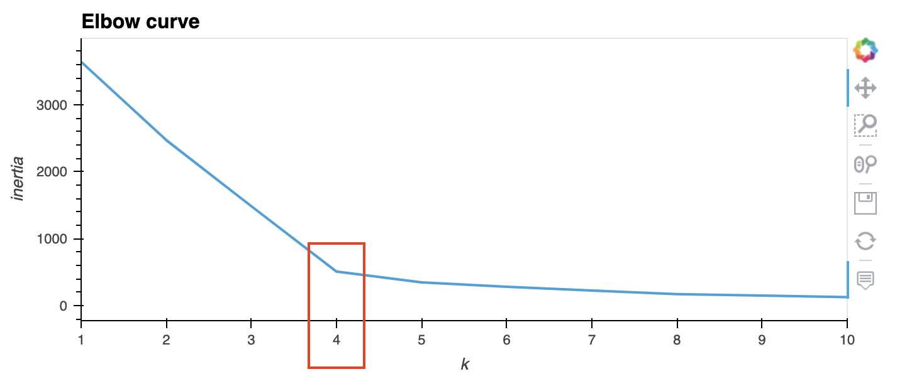
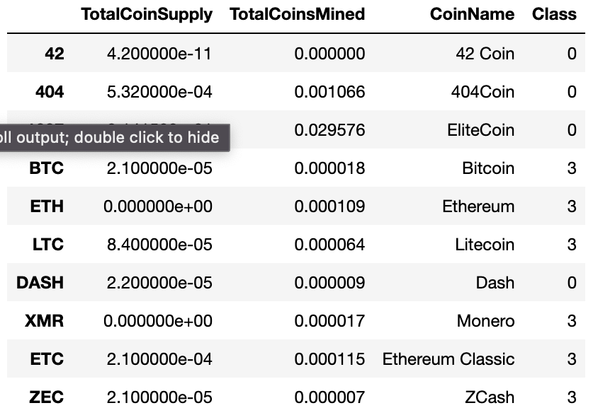
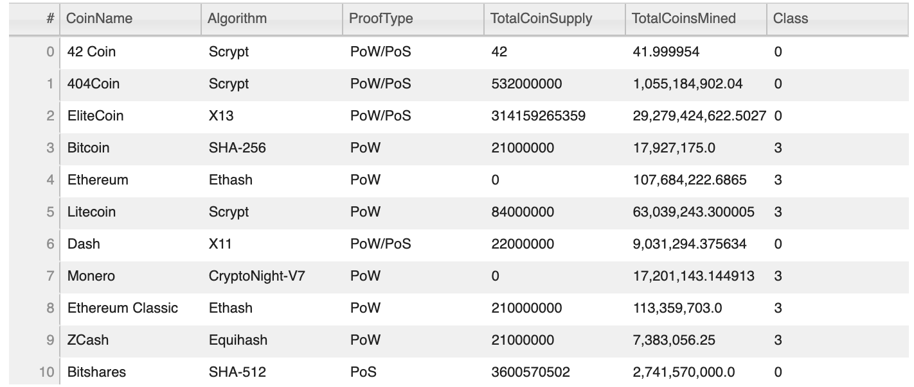
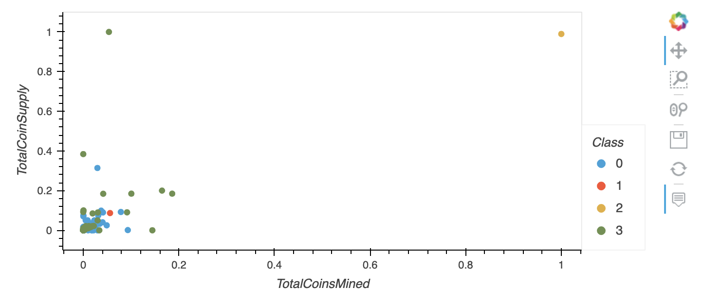

# Cryptocurrencies Project

A prominent investment bank is interested in offering a cryptocurrency investment portfolio for its customers.  In this project, we explore available data to get information about the cryptocurrencies that are on the trading market and how they can be classified.

The data used in this project could be find [here](Resources/crypto_data.csv). Since the data does not have known output about categorization of cryptocurrencies, we will use unsupervised learning algorithm: `K-means`, and a pre-processing transformation: `Principal Component Analysis (PCA)`.

## Preprocessing the Data for PCA

Before applying the clustering algorithm, the data needs to be cleaned and prepared. Rows with at least one null value or without coins being mined are removed. As well as, text variables are converted to numerical values (`get_dummies` function), and standardized using the `StandardScaler fit_transform()` function.  Figure 1 shows the DataFrame after applying all the pre-processing:

Figure 1. Cryptocurrences DataFrame

## Reducing Data Dimensions Using PCA

The dimensions of the pre-processed dataframe is then reduced using the PCA algorithm. The new DataFrame with dimensions reducre to three PCs: `PC 1`, `PC 2` and `PC 3` is shown in Figure 2.

Figure 2. Principal Components of Cryptocurrences DataFrame

## Clustering Cryptocurrencies Using K-means 

After the dimensionality reduction, we find an appropriate value for K (number of clusters) by using an **Elbow Curve**. Figure 3 shows this curve with the chosen K highlighted in red.

Figure 3. Classification of Cryptocurrences DataFrame using the K-means Algorithm

With  `K = 4`, the K-means algorithm is run to predict the four clusters for the cryptocurrencies.

Figure 3. Classification of Cryptocurrences DataFrame using the K-means Algorithm

## Visualizing Cryptocurrencies Results

Figure 4. Table with Cryptocurrences and Classes

Figure 5. ScatterPlot showing distribution of Cryptocurrences by Classes

## Summary

