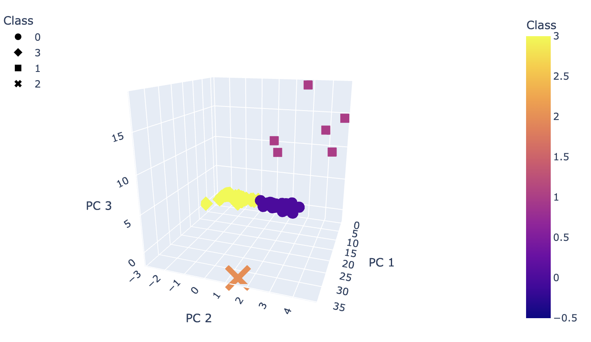

# Cryptocurrencies Project

A prominent investment bank is interested in offering a cryptocurrency investment portfolio for its customers.  In this project, we explore available data to get information about the cryptocurrencies that are on the trading market and how they can be classified.

The data used in this project could be find [here](Resources/crypto_data.csv). Since the data does not have known output about categorization of cryptocurrencies, we will use unsupervised learning algorithm: `K-means`, and a pre-processing transformation: `Principal Component Analysis (PCA)`.

## Preprocessing the Data for PCA

Before applying the clustering algorithm, the data needs to be cleaned and prepared. Rows with at least one null value or without coins being mined are removed. As well as, text variables are converted to numerical values (`get_dummies` function), and standardized using the `StandardScaler fit_transform()` function.  Figure 1 shows the DataFrame after applying all the pre-processing:

Figure 1. Cryptocurrencies DataFrame

## Reducing Data Dimensions Using PCA

The dimensions of the pre-processed dataframe is then reduced using the PCA algorithm. The new DataFrame with dimensions reducre to three PCs: `PC 1`, `PC 2` and `PC 3` is shown in Figure 2.

Figure 2. Principal Components of Cryptocurrencies DataFrame

## Clustering Cryptocurrencies Using K-means 

After the dimensionality reduction, we find an appropriate value for K (number of clusters) by using an **Elbow Curve**. Figure 3 shows this curve with the chosen K highlighted in red.

Figure 3. Classification of Cryptocurrencies DataFrame using the K-means Algorithm

With  `K = 4`, the K-means algorithm is run to predict the four clusters for the cryptocurrencies.

Figure 3. Classification of Cryptocurrencies DataFrame using the K-means Algorithm

## Visualizing Cryptocurrencies Results

Clustering results are shown in two ways: As scatterplots showing distributions and Tables. Figure 4 shows the 3D scatterplot of the cryptocurrencies in the principal components dimension, grouped in four clusters. 
Figure 5 shows a table with all the currently tradable cryptocurrencies and Figure 6 the corresponding scatterplot.

Figure 4. 3D Scatter Plot of Cryptocurrencis Classes in the PCA dimension

Figure 5. Table showing the Cryptocurrencis and their classification in four clusters

Figure 6. 2D Scatter Plot showing distribution of Cryptocurrencis by Classes

## Summary

Cryptocurrency trademarking is explored in this project. An initial classification is intended by using K-means algorithm.  Before to apply the clustering algorithm, a cleaning of the data as well as a dimensionality reduction are performed. The final results shows that there are 532 cryptocurrencies in the trade market that can be categorized in 4 classes.
